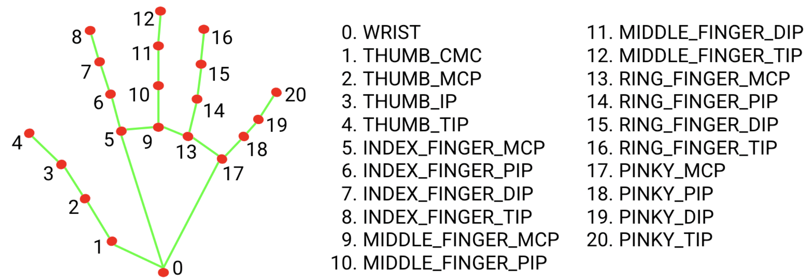
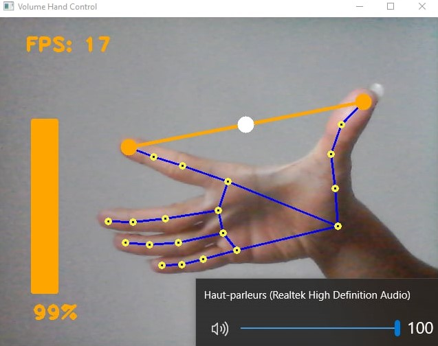
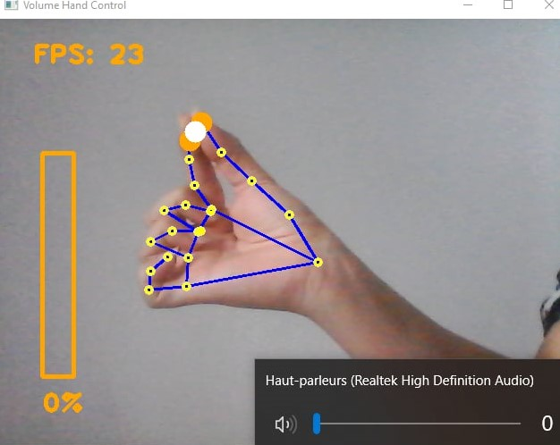

# Volume Hand Control

A computer vision project to control system volume with hand gestures using a webcam. OpenCV is used for webcam access and image manipulation, MediaPipe (via a custom `HandTrackingModule`) is used for hand detection and landmark extraction, and Pycaw is used to control the device speaker volume on Windows.

---

## Features

* Detects up to two hands and extracts landmarks.
* Uses the ratio between thumb–index distance and a hand reference length to estimate relative hand openness.
* Maps the normalized ratio to system volume via Pycaw.
* Simple on-screen volume bar and percentage display.

---

## Requirements

* Python 3.8+
* opencv-python==4.11.0.86
* mediapipe==0.10.21
* numpy==1.26.4
* pycaw==20251023
* protobuf==4.25.3

> ⚠️ Important: Use the versions above to avoid conflicts between `mediapipe` and `protobuf`.

> 💡 Recommended: Use a Python virtual environment (`.venv`) to install dependencies to avoid version conflicts.

```bash
pip install -r requirements.txt
```

---

## Project Structure

* `VolumeHandControl.py` — main script that reads webcam frames, detects hands, computes ratio and sets system volume.
* `HandTrackingModule.py` — custom module with `HandDetector` class that wraps MediaPipe hand detection.
* `README.md` — this file.
* `requirements.txt` — Python dependencies.
* `images/` — folder containing reference images:

  * `open.png` — hand fully open
  * `pinch.png` — thumb-index pinch
  * `landmarks.png` — hand landmarks

---

## HandTrackingModule (HandDetector)

`HandDetector` is a wrapper around MediaPipe Hands providing simple APIs used by `VolumeHandControl`.

**Constructor attributes (typical)**:

* `maxHands` (int): maximum number of hands to detect (default 1–2).
* `min_detection_confidence` (float): threshold for initial detection.
* `min_tracking_confidence` (float): threshold for tracking confidence.

**Methods**:

* `findHands(img, draw=True)`

  * Converts BGR to RGB, runs MediaPipe Hands, draws landmarks and connections (if `draw=True`).
  * Returns the image with landmarks drawn if requested.

* `findPosition(img, handNo=0, draw=True)`

  * Returns a list of landmark coordinates `[id, x, y]` for the requested hand.
  * Optionally draws landmarks.



---

## VolumeHandControl

**Algorithm overview**:

1. Detect hand landmarks → compute Euclidean distance `L` between thumb tip (ID 4) and index tip (ID 8).
2. Compute reference length `H` (wrist ID 0 to index MCP ID 5).
3. Ratio = `L / H`.
4. Clamp ratio between calibrated `min_ratio` and `max_ratio`.
5. Apply smoothing factor `alpha`.
6. Map ratio linearly (or logarithmically for natural perception) to system volume range using Pycaw.
7. Draw on-screen volume bar and percentage.

**How to run**:

```bash
pip install -r requirements.txt
python VolumeHandControl.py
```

**Calibration & tuning**:

* `min_ratio` and `max_ratio` define your hand's minimal and maximal openness.

  * Measure by printing `ratio` with fingers fully pinched and fully opened.
* `alpha` controls smoothing: higher → more stable bar, lower → more responsive but jittery.

**Controls**:

* Thumb + index pinch/openness controls volume.
* Landmarks used: tip IDs 4 and 8, wrist 0, index MCP 5.




---

## Known Limitations

* Volume bar and percentage are not exact due to 2D webcam perspective, occlusion, and camera distance.
* Ratio normalization by hand reference length helps reduce these effects.

---

## Future Improvements

* Increase accuracy of `volBar` and `volPer`:

  * Use multiple reference lengths or triangulate hand orientation to better normalize distance.
  * Apply depth estimation with stereo cameras or more landmarks.
  * Apply logarithmic mapping to volume to match human audio perception:

    * Humans perceive loudness logarithmically, so small changes at low volumes are more noticeable than the same change at high volumes.
  * Apply adaptive calibration at start-up to reduce variability between sessions.

---

## Troubleshooting

* If hands are not detected reliably, increase lighting or adjust `min_detection_confidence`.
* Pycaw requires COM access and works on Windows only.

---


